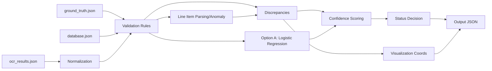

# Design Document - Invoice Validation System

## Overview
This document describes a proof-of-concept invoice validation system that
matches OCR-extracted fields against ground truth and database records,
classifies discrepancies, and outputs validation status with confidence.

## Approach
1. Data ingestion
   - Read ground_truth.json, ocr_results.json, database.json.
   - Basic schema validation to ensure required keys exist.

2. Normalization
   - Text: lowercase, strip punctuation, collapse whitespace.
   - Company suffix normalization (inc, llc, ltd, co).
   - Address abbreviation normalization (street -> st, drive -> dr).
   - OCR confusable mapping (O/0, I/1/l, S/5, B/8).

3. Matching and validation
   - ID fields (PO): exact match after OCR-confusion normalization.
   - Names/addresses: fuzzy similarity (token set + edit ratio).
   - Dates: tolerance window in days.
   - Amounts: absolute and relative tolerance.
   - Database references:
     - PO vendor used as primary expected vendor name.
     - vendor_master address used for vendor address validation when available.
     - customer_info billing_address used for customer address validation.
     - tax_rate from PO used to cross-check tax_amount.
   - Line items: parse text to (description, qty, unit_price, total).
     - Item not in PO list -> critical.
     - Quantity above max -> critical.
     - Line total mismatch -> warning.

4. Discrepancy scoring and status
   - Discrepancy severity: critical / warning / informational.
   - Overall confidence combines OCR confidence and rule penalties.
   - Status logic:
     - critical -> needs_review (POC default).
     - warnings or low confidence -> needs_review.
     - otherwise approved.

5. Option A (ML)
   - Logistic regression predicts probability a field is wrong.
   - Features: OCR confidence, text length, digit ratio, fuzzy score,
     amount/date diffs, field identity.
   - Model output calibrates confidence per field and overall score.

## Pipeline Diagram

## Rule Rationale & Thresholds
- PO/ID fields: strict matching is required because they drive payment linkage
  and vendor approval; OCR-confusion normalization (O/0, I/1/l, S/5, B/8)
  reduces false rejections from common OCR errors.
- Names/addresses: fuzzy matching handles abbreviations and truncation; thresholds
  are softer to avoid penalizing minor formatting differences.
- Dates: tolerance of 1-3 days is treated as warning based on typical OCR/entry
  drift; larger gaps are critical.
- Amounts: combined absolute and relative tolerance captures rounding/tax noise
  across both small and large invoices.
- Tax: tax_amount is cross-checked against PO tax_rate when available to validate
  accounting consistency.
- Line items: items not in PO list or quantity above max are critical because
  they violate approved purchasing rules; line total drift is warning to allow
  minor rounding.
- Status policy: in POC, critical issues route to needs_review to keep a
  human-in-the-loop; production can flip to rejected if desired.

## Assumptions and Limitations
- OCR output is structured and aligned to field names.
- Ground truth is available for training (self-supervised labels).
- Limited sample size: ML model is illustrative only.
- Address parsing is token-based, not full geocoding.

## Scalability Considerations
- Batch or streaming validation supported (stateless rules).
- Thresholds and mappings are centralized in config for tuning.
- Add vendor-specific templates to improve field extraction.
- Introduce async processing for large volumes.

## Deliverables Mapping
- Notebook: data overview and metrics (data_overview.ipynb).
- Core engine: src/* modules.
- Sample outputs: sample_outputs/*.json (via scripts/generate_sample_outputs.py).
- Tests: pytest with 15 cases.
